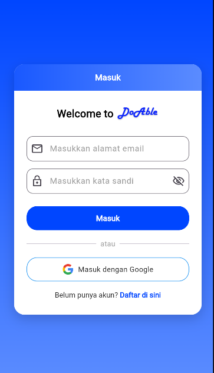
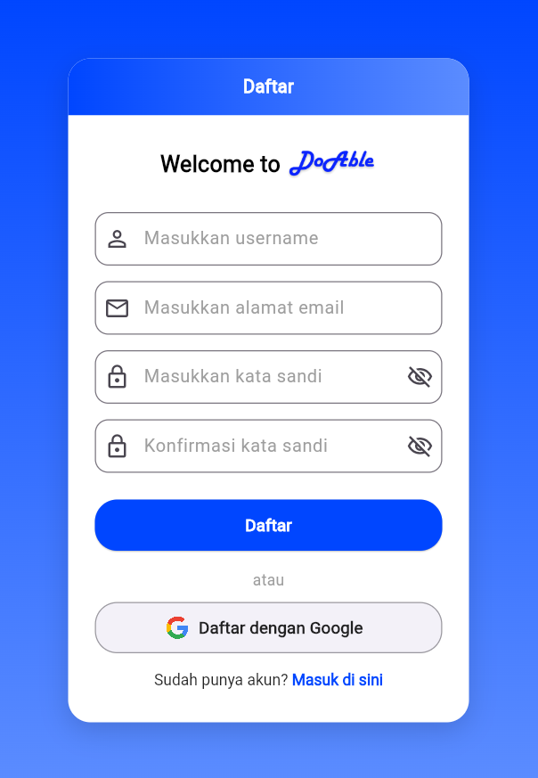
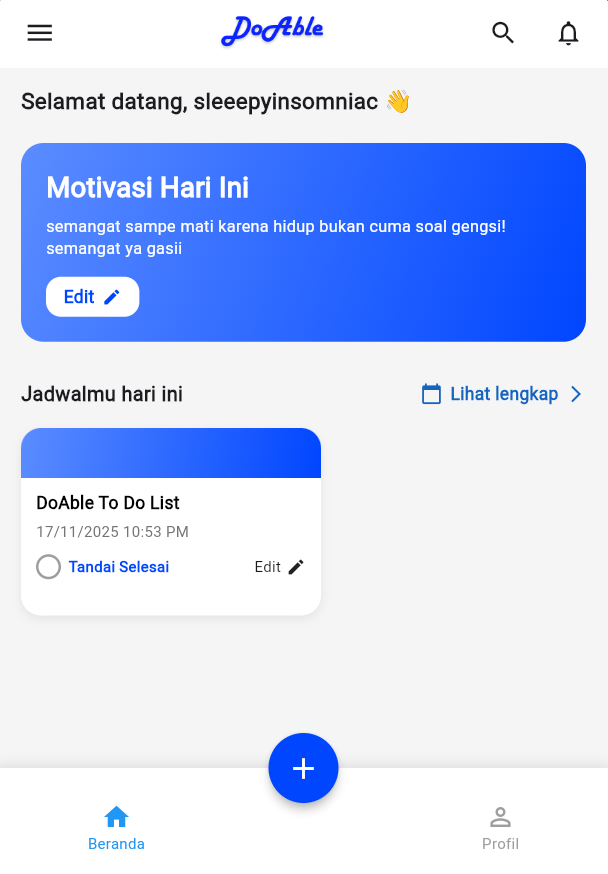
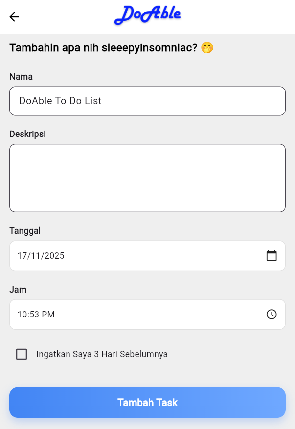
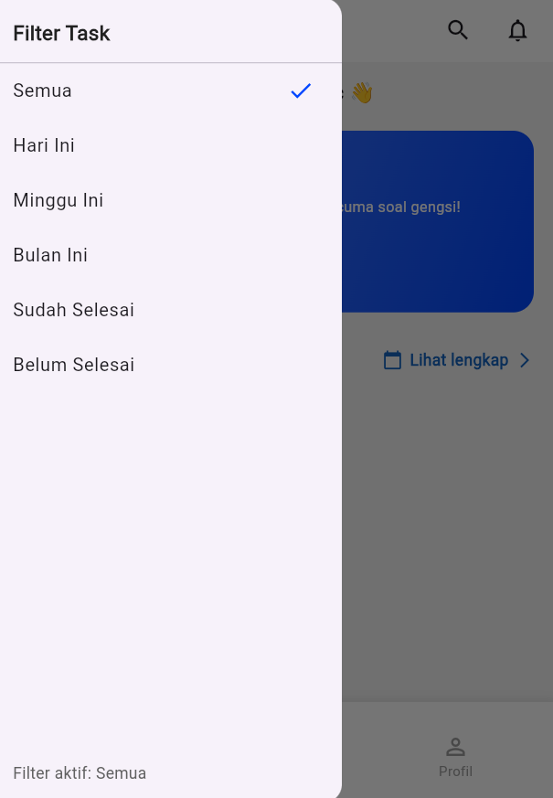
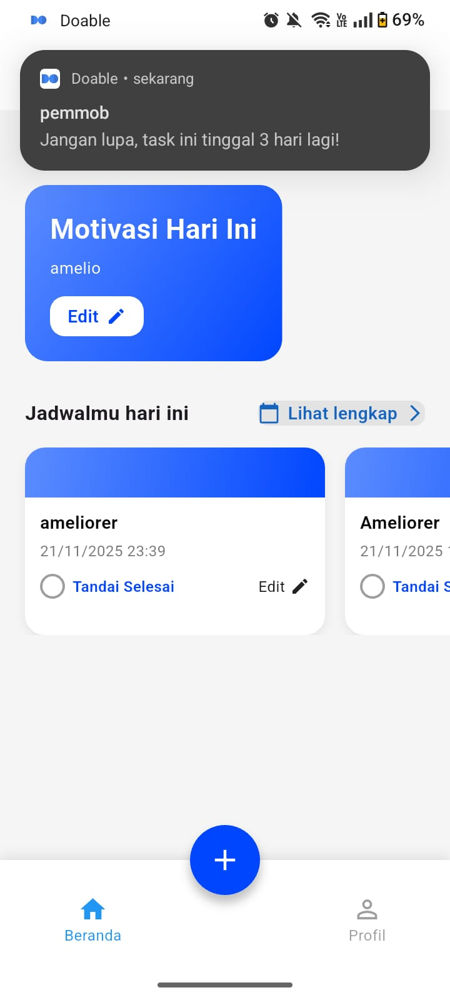
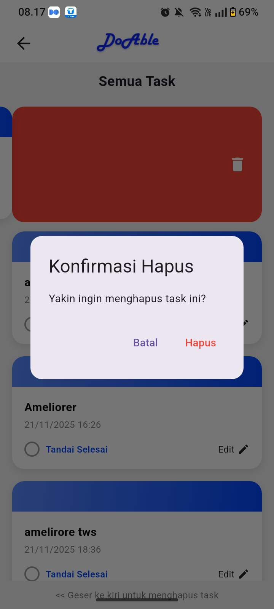
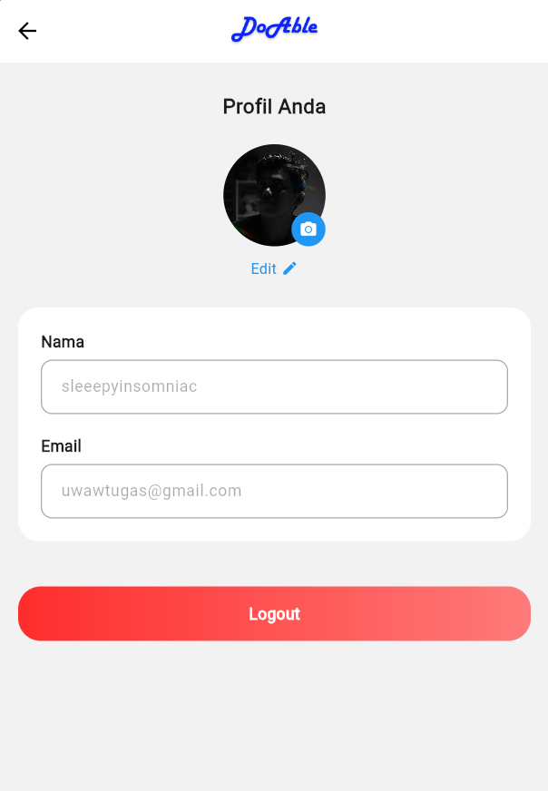

<a name="readme-top"></a>
<br />
<div align="center">
  <a href="https://github.com/Supppp0510/doable_todo_app_remake">
    
  </a>

<h3 align="center">Doable Todo List App - Remake/Test Project</h3>

  <p align="center">
    💡 Aplikasi Todo List Online/Cloud menggunakan **Flutter** dan **Firebase** (Proyek Remake untuk tujuan pengujian).
    <br />
    <br>
    <a href="https://github.com/Supppp0510/doable_todo_app_remake/issues">Laporkan Bug</a>
    ·
    <a href="https://github.com/Supppp0510/doable_todo_app_remake/issues">Ajukan Fitur</a>
  </p>

<a href="https://github.com/Supppp0510/doable_todo_app_remake">
<a href="https://github.com/Supppp0510/doable_todo_app_remake/issues">
<a href="https://github.com/Supppp0510/doable_todo_app_remake">
<a href="https://github.com/Supppp0510/doable_todo_app_remake">
<br>
[](https://flutter.dev)
[](https://dart.dev)
[](https://firebase.google.com)
[](https://opensource.org/licenses/MIT)

</div>

---

<details>
  <summary>Daftar Isi</summary>
  <ol>
    <li><a href="#latar-belakang-proyek">Latar Belakang Proyek</a></li>
    <li><a href="#fitur-utama">Fitur Utama</a></li>
    <li>
      <a href="#memulai-proyek">Memulai Proyek</a>
      <ul>
        <li><a href="#prasyarat">Prasyarat</a></li>
        <li><a href="#instalasi">Instalasi</a></li>
      </ul>
    </li>
    <li><a href="#arsitektur-teknis">Arsitektur Teknis</a></li>
    <li><a href="#galeri-aplikasi">Galeri Aplikasi</a></li>
    <li><a href="#kontribusi">Kontribusi</a></li>
    <li><a href="#lisensi">Lisensi</a></li>
    <li><a href="#kontak-dan-referensi">Kontak dan Referensi</a></li>
  </ol>
</details>

---

# Latar Belakang Proyek

Proyek ini adalah **remake** dan **pengujian ulang** dari aplikasi "Doable Todo List App" yang aslinya dikembangkan oleh **Akhin Abraham**. Proyek ini digunakan untuk tujuan pengembangan, pengujian integrasi penuh **Firebase** (termasuk Database dan Otentikasi), serta eksplorasi fitur *cloud* di lingkungan Flutter.

Aplikasi ini beroperasi secara *online* menggunakan Firebase sebagai *backend* utama.

---

## ⚙️ Fitur Utama

- ✅ **Task Management** - Membuat, mengedit, menghapus tugas dengan sinkronisasi *real-time*.
- ⏰ **Pengingat & Notifikasi** - Pengaturan tanggal dan waktu dengan notifikasi *push*.
- 🔄 **Aturan Pengulangan** - Opsi harian, mingguan, bulanan.
- 🔑 **Google Authentication** - Integrasi otentikasi melalui akun Google.
- ☁️ **Cloud Database** - Penyimpanan data tugas sepenuhnya di Cloud Firestore/Realtime Database.

<p align="right">(<a href="#readme-top">back to top</a>)</p>

---

### Dibangun Dengan

| Technology | Tujuan | Versi |
|------------|---------|---------|
| [Flutter](https://flutter.dev) | UI Framework & Logic | 3.0+ |
| [Dart](https://dart.dev) | Bahasa Pemrograman | 3.2.6+ |
| [Firebase Auth] | Otentikasi Pengguna (Termasuk Google Sign-In) | Sesuai konfigurasi |
| [Cloud Firestore/RTDB] | Basis Data Cloud | Sesuai konfigurasi |

<p align="right">(<a href="#readme-top">back to top</a>)</p>

---

## Memulai Proyek

### Prasyarat

* [Flutter SDK](https://flutter.dev/docs/get-started/install) (3.0+)
* Android Studio atau VS Code dengan ekstensi Flutter.
* **Akun Firebase** dan Proyek yang sudah dikonfigurasi.

### Instalasi

1.  **Clone Repositori Anda:**
    ```bash
    git clone [https://github.com/Supppp0510/doable_todo_app_remake.git](https://github.com/Supppp0510/doable_todo_app_remake.git)
    ```

2.  **Masuk ke Direktori Proyek & Ambil Dependensi:**
    ```bash
    cd doable_todo_app_remake
    flutter pub get
    ```

3.  **Konfigurasi Firebase (Wajib):**
    * Karena file sensitif tidak termasuk (seperti `google-services.json` dan `firebase_options.dart`), Anda harus **mendapatkan file konfigurasi** dari pemilik proyek atau mengaturnya secara lokal dari [Firebase Console](https://console.firebase.google.com/).
    * **Penting:** Aktifkan **Google Sign-In** di Firebase Authentication Console.
    * Letakkan `google-services.json` di `android/app/`.

4.  **Jalankan Aplikasi:**
    ```bash
    flutter run
    ```

<p align="right">(<a href="#readme-top">back to top</a>)</p>

---

## 🎨 Galeri Aplikasi

Berikut adalah beberapa tampilan aplikasi:

<p align="center">


 
 
 



</p>

---

## Kontak dan Referensi

**Proyek Remake Oleh:**

* Supppp0510 - https://github.com/ldclabs/anda

**Repositori Proyek Asli:**

* Proyek ini didasarkan pada repositori milik **Akhin Abraham** di [https://github.com/theakhinabraham/doable-todo-list-app](https://github.com/theakhinabraham/doable-todo-list-app).
* **Lisensi:** Proyek ini mengikuti Lisensi MIT dari repositori aslinya.

<p align="right">(<a href="#readme-top">back to top</a>)</p>
